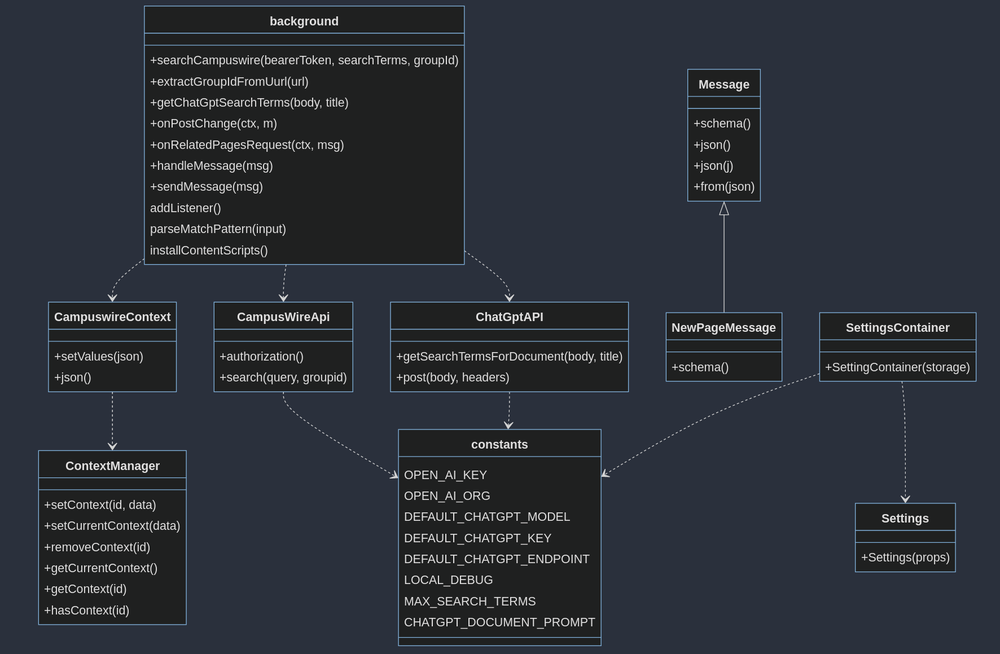

# CS410 Project - Team DAMDT - Fall 2023

## Final Submission

- Setup https://youtu.be/PRn2CEoyLtc
- Demo Walkthrough https://youtu.be/JcK99AcLFAI
- Technical Walkthrough https://youtu.be/tSTnyEb3fmg

## Team Members

- David Anderson
- Andrew Chiang
- Mridul Ghanshala
- Dave Pankros
- Timothy Ling


## Project Summary

The free topic we chose centers around the Intelligent Browsing Theme. When
viewing a post on Campuswire, the user is unable to view other existing relevant posts.
This can make finding relevant posts tedious. Also, when the user is creating a post,
they are unable to see if a similar post already exists. This can lead to duplicate posts
being created. Duplicate posts mean duplicate replies or replies that simply refer to
another post.
Our project will create a Google chrome extension to make relevant documents
readily available via a sidebar. We plan on reading in the current post or the post being
written depending on cursor focus. Then we will generate query terms for the post by
using chatGPT or TF-IDF. We will then use these query terms to search for relevant
posts, either by leveraging the existing search in Campuswire or by using TF-IDF. We
will then populate the sidebar UI with the top x documents returned from the search. For
our implementation, we plan to use Javascript as our language of choice.


## List of Tasks

- Setup browser extension: Setup environment (10 hours)
- Data gathering: The current title and body or document being created
based on cursor focus. (20 hours)
- Query term generation - Use the data gathered to make a query to
chatGPT for the search terms. (30 hours)
- Find relevant docs - Use search terms, either by leveraging the existing
search from campuswire or by using TF-IDF. (20 hours)
- Create sidebar UI - Create ui and populate content from search results.
- Create settings page. (20 hours)


## Running the Chrome Extension

### Requirements

- Chrome web browser
- npm (Development Build)


### Development Build
```bash
#Git Checkout
git checkout git@github.com:dpankros/cs410_project.git
cd cs410_project

#Build command
npm i
npm run build

#Alternate command
npm run start
```
When you make a change, run `npm run build` again


### Automated Build

GitHub Actions are used to automatically build the extension. 


## Deploy

### From an Automated Release

1. Click on a version under the Releases heading on the right column of the homepage.
2. Click on "release.zip" under the Assets heading.
4. In Chrome, open your [extensions page](chrome://extensions/) and ensure "Developer mode" is on in the upper right corner.
5. Drag the release.zip file to your Chrome extensions page.
6. (Optional) Click on the "Details" button of the extension, and then the "Extension options" link.  Enter an OpenAI API Key and Organization then close this page.
1. Open a new tab in the browser and navigate to [Campuswire](https://www.campuswire.com)

_NOTE: Sometimes Chrome does not install the extension when dragged onto the extensions page.  If this happens to you, refresh the page and it should work properly._

### From Source

1. Checkout the source of this project
2. Run `npm i` then `npm start`.  A build folder will be created.
4. In Chrome, open your [extensions page](chrome://extensions/) and ensure "Developer mode" is on in the upper right corner.
1. Click "Load unpacked"
1. Select the build folder created, above.
2. (Optional) Click on the "Details" button of the extension, and then the "Extension options" link.  Enter an OpenAI API Key and Organization then close this page.
1. Open a new tab in the browser and navigate to [Campuswire](https://www.campuswire.com)


## Class Documentation

Documentation for pertinent code contained in this repository.



### CampusWireApi

#### Functions

_authorization()_

>description: Returns the user Bearer token to be used for campuswire API actions
>
>inputs: void
>
>outputs: authorized Bearer token


_search(query, groupid)_

>description: Performa search on the CampusWire site using the API
>
>inputs: query - string container query terms, groupID - 
>
>outputs: array map of posts which match the query, with the following keys for each post - title, postNumber, body, id, groupId, publishedAt, url


### CampuswireContext
  
_setValues(json)_

>description: Set values for CampusWire context object with only select propery names allowed - groupID, url, token, pages, error, searcTerms, usedChatGPT, postNumber
>
>inputs: JSON object of property names
>
>outputs: none

_json()_

>description: Getter for JSON representation of the campuswire context
>
>inputs: void
>
>outputs: JSON object containing only the allowed property names


### ChatGptAPI

_getSearchTermsForDocument(body, title)_

>description: Query chat GPT to identify search terms associated with a document
>
>inputs: body - document body for a campuswire post, title - title for a campuswire post
>
>outputs: search terms for the document

_post(body, headers)_

>description: Helper function for querying Chat GPT using an HTTP POST
>
>inputs: body - document body, headers - header for document
>
>outputs: standard return message from HTTP POST
    
### ContextManager

_setContext(id, data)_

>description: Set context data for a given ID
>
>inputs: id - context id, data - data to add to context
>
>outputs: context object

_setCurrentContext(data)_

>description: Set context data for the current tab
>
>inputs: data - data to add to context
>
>outputs: context object


_removeContext(id)_

>description: Remove context with specified ID
>
>inputs: id - context id
>
>outputs: none

_getCurrentContext()_

>description: Getter for the context on the current tab 
>
>inputs: none
>
>outputs: context object, or null context

_getContext(id)_

>description: Getter for context of the specified id
>
>inputs: id - context id
>
>outputs: clone of context of id if it exists, or a new context with the specified id

_hasContext(id)_
    
>description: Boolean function to determine of context id exists
>
>inputs: id - context id
>
>outputs: boolean of context id existence

### EventEmitter

_listenerCount(eventName)_

>description: Get the current listener count
>
>inputs: eventName - name of the event 
>
>outputs: count of the listeners for the event


_listeners(eventName)_

>description: Get an array of listeners for an event
>
>inputs: eventName - name of the event
>
>outputs: array of listeners for an event


_prependListener(eventName, listener)_

>description: Add a new listener to the front of an array
>
>inputs: eventName - name of the event, listener - listener to add
>
>outputs: EventEmitter object


_prependOnceListener(eventName, listener)_

>description: Add the specified listener to the first occurence of the event, once. After the specified listener has been executed, it is removed.
>
>inputs: eventName - name of the event, listener - listener to add 
>
>outputs: EventEmitter object

_on(evenName, listener)_

>description: Add listener to named event
>
>inputs: eventName - name of the event, listener - listener to add
>
>outputs: EventEmitter object

_once(eventName, listener)_

>description: Add the specified listener once to event, then removed once listener is executed
>
>inputs: eventName - name of the event, listener - listener to add
>
>outputs: EventEmitter object

_off(eventName, listener)_

>description: Remove specified listener from an event
>
>inputs: eventName - name of the event, listener - listener to add
>
>outputs: EventEmitter object

_emit(eventName, args)_

>description: Call all listeners associated with an event
>
>inputs: eventName - name of the event, args - args to pass to each listener
>
>outputs: EventEmitter object

_addListener(evenName, listener)_

>description: Add a listener to an event
>
>inputs: eventName - name of the event, listener - name of the listener
>
>outputs: EventEmitter object

_removeListener(eventName, listener)_

>description: Remove a listener from an event
>
>inputs: eventName - name of the event, listener - name of the listener
>
>outputs: EventEmitter object

_removeAllListeners(eventName)_

>description: Removes all listeners from an event
>
>inputs: eventName - name of the event
>
>outputs: EventEmitter object

_eventNames()_

>description: Get a list of all event names
>
>inputs: none
>
>outputs: list of all current event names

_setMaxListeners(n)_

>description: Set the maximum number of listeners
>
>inputs: n - number of listeners
>
>outputs: EventEmitter object

_getMaxListeners()_

>description: Get the current maximum number of listeners
>
>inputs: none
>
>outputs: current maximum number of listeners

### Message

_schema()_

>description: Unimplemented abstract method that enforces schema validation when implemented
>
>inputs: none
>
>outputs: json schema

_json()_

>description: Get the current message body as json
>
>inputs: none
>
>outputs: JSON message body

_json(j)_

>description: Set the current message body json
>
>inputs: j - json message body
>
>outputs: none

_from(json)_

>description: Get a message object with specified json as message body
>
>inputs: json - json message body
>
>outputs: Message object


### NewPageMessage

_schema()_

>description: Implementation of schema as a body: <string> object
>
>inputs: none
>
>outputs: Message body schema


### WordNetSynonyms

_synonymFor(word)_

>description: Utilize external web service to determine synonyms for a specified word
>
>inputs: word - word string
>
>outputs: array list of synonyms to the specified word

### background 

_searchCampuswire(bearerToken, searchTerms, groupId)_

>description: Search campuswire for posts using authenticated user
>
>inputs: bearerToken - CampusWire auth token, searchTerms - query terms to search, groupId - group id for campuswire
>
>outputs: array map of campuswire search term results

_extractGroupIdFromUurl(url)_

>description: Get the group Id from the specified URL
>
>inputs: url - url to parse for groupid
>
>outputs: group id located in the url, or null if not located

_getChatGptSearchTerms(body, title)_

>description: Obtain search terms from ChatGPT
>
>inputs: body - body text of a campuswire post, title - title of a campuswire post
>
>outputs: search terms from ChatGPT, or throws exception/error

_onPostChange(ctx, m)_

>description: On a post change, re-evaluate search terms either by chatGPT or fallback(ie, search terms are the title)
>
>inputs: ctx - context, m - message
>
>outputs: none

_onRelatedPagesRequest(ctx, msg)_

>description: Send a message with related pages on a related page request event
>
>inputs: ctx - context, msg - message
>
>outputs: none

_handleMessage(msg)_

>description: Handle message a received message, specifically for POST_LOADED or RELATED_PAGE_REQUEST messages
>
>inputs: msg - message
>
>outputs: none

_sendMessage(msg)_

>description: Send a message
>
>inputs: msg - message
>
>outputs: none

_parseMatchPattern(input)_

>description: Parse input string for https/file/ftp/chrome-extension patterns
>
>inputs: input - text string
>
>outputs: array of string matched patterns


### Settings
  
_Settings(props)_

>description: Define a settings page for OpenAI properties (openai key, openai org)
>
>inputs: props - properties
>
>outputs: none
    
### SettingsContainer
  
_SettingContainer(storage)_

>description: Container to hold settings for OpenAI properties
>
>inputs: storage - browser storage
>
>outputs: none

### constants

>_OPEN_AI_KEY_ - OpenAI API Key
>
>_OPEN_AI_ORG_ - OpenAI Organization
>
>_DEFAULT_CHATGPT_MODEL_ - ChatGPT Model to use
>
>_DEFAULT_CHATGPT_KEY_ - ChatGPT API Key
>
>_DEFAULT_CHATGPT_ENDPOINT_ - ChatGPT Endpoint URL
>
>_LOCAL_DEBUG_ - Enable/Disable local debug logging
>
>_MAX_SEARCH_TERMS_ - Maximum allowed search terms
>
>_CHATGPT_DOCUMENT_PROMPT_ - Prompt template to use for ChatGPT
